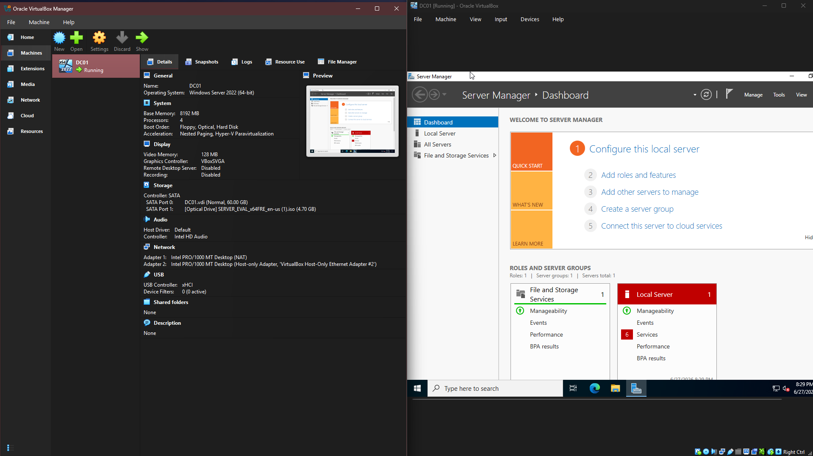
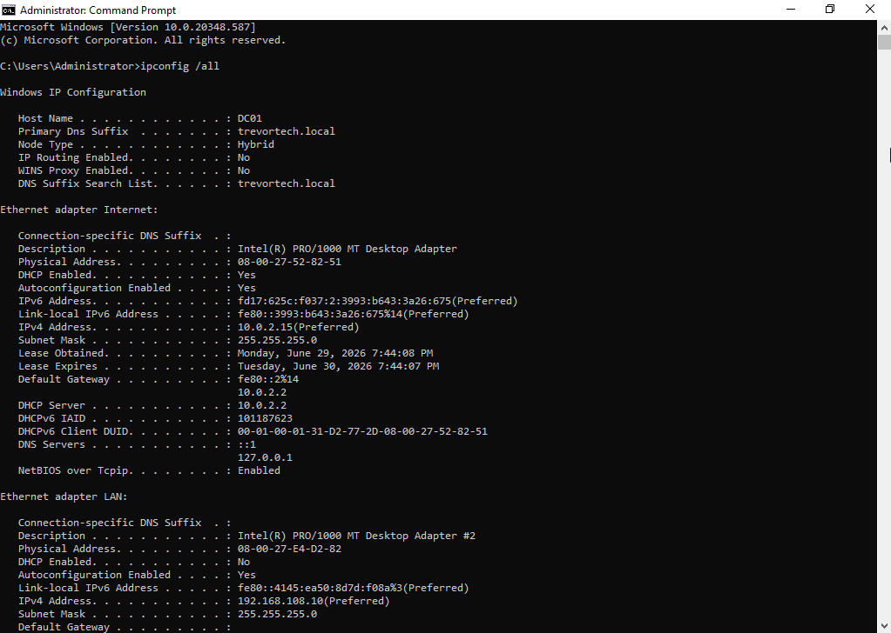

# Windows Server Installation

## Objective

The objective of this phase was to build the foundation of the Active Directory lab by deploying a Windows Server 2022 virtual machine. This server functions as the primary Domain Controller (DC01) and provides Active Directory Domain Services (AD DS), DNS, and DHCP services for the **trevortech.local** domain.

---

## Environment

| Component               | Configuration                                                |
| ----------------------- | ------------------------------------------------------------ |
| Host Operating System   | Windows 11                                                   |
| Virtualization Platform | Oracle VirtualBox                                            |
| Guest Operating System  | Windows Server 2022 Standard Evaluation (Desktop Experience) |
| VM Name                 | DC01                                                         |
| Memory                  | 4 GB RAM                                                     |
| Processors              | 3 vCPUs                                                      |
| Storage                 | 60 GB Dynamically Allocated VDI                              |
| Domain                  | trevortech.local                                             |

---

## Virtual Machine Configuration

The Windows Server virtual machine was created in Oracle VirtualBox and configured with resources appropriate for a small enterprise Active Directory environment. The server serves as the central infrastructure for authentication, DNS name resolution, and DHCP address assignment for all domain-joined client computers in the lab.

**Figure 1.** Oracle VirtualBox configuration for the DC01 virtual machine.

---

## Installation Process

1. Downloaded the Windows Server 2022 Evaluation ISO from Microsoft.
2. Created a new virtual machine named **DC01** in Oracle VirtualBox.
3. Allocated:

   * 4 GB RAM
   * 3 virtual processors
   * 60 GB dynamically allocated virtual hard disk
4. Installed Windows Server 2022 Standard Evaluation (Desktop Experience).
5. Created the local Administrator account password.
6. Completed the Windows Server initial setup and verified a successful installation.

---

## Initial Configuration

After the operating system installation, the following configuration tasks were completed:

* Renamed the server to **DC01**
* Configured a static IPv4 address (`192.168.108.10`)
* Configured the server to use itself as the preferred DNS server
* Installed the latest available Windows updates
* Installed the Active Directory Domain Services (AD DS) role
* Promoted the server to the first domain controller for the **trevortech.local** forest
* Installed and configured the DNS Server role
* Installed and configured the DHCP Server role
* Authorized the DHCP server within Active Directory
* Created a DHCP scope for client computers on the lab network

---

## Networking

The lab environment uses a dedicated VirtualBox Host-Only network to isolate the Active Directory environment from the physical home network.

| Adapter              | Configuration     |
| -------------------- | ----------------- |
| Network Type         | Host-Only Adapter |
| Domain Controller IP | 192.168.108.10    |
| Client Example       | 192.168.108.101   |
| Subnet Mask          | 255.255.255.0     |
| Domain               | trevortech.local  |

Using a Host-Only network allows client computers and the domain controller to communicate in an isolated environment while preventing unintended interaction with devices on the physical network. The Domain Controller provides DHCP, DNS, and authentication services for all virtual machines connected to the lab network.

---

## Validation

The following validation steps were completed after installation:

* Successfully logged into Windows Server.
* Verified the static IP configuration using `ipconfig`.
* Confirmed DNS resolution for **trevortech.local**.
* Verified successful installation of the Active Directory Domain Services role.
* Confirmed successful promotion of the server to a Domain Controller.
* Verified DNS Server and DHCP Server roles were functioning correctly.
* Confirmed client computers could obtain IP addresses from DHCP.
* Verified the domain controller responded to network connectivity tests.

**Figure 2.** DC01 IP configuration.
---

## Lessons Learned

Building the Domain Controller first made the rest of the lab much easier to set up. Configuring Active Directory, DNS, and DHCP on an isolated Host-Only network helped me better understand how these services work together in a Windows domain environment.

