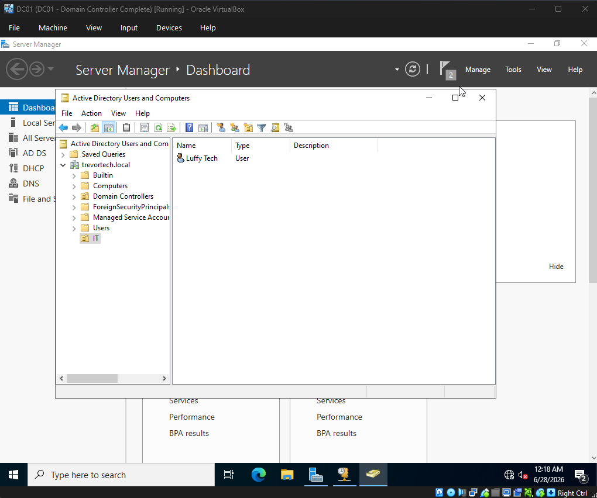

# Active Directory Configuration

## Objective

In this phase, I configured Active Directory on **DC01** by creating a simple organizational structure and a test user account. The goal was to simulate a minimal but realistic enterprise setup with a dedicated IT department and a standard domain user.

---

## Organizational Units

To keep the environment clean and easy to manage, I created two Organizational Units (OUs):

* IT
* Users

The **IT OU** is intended for administrative accounts and future infrastructure management objects, while the **Users OU** contains standard domain user accounts.

---

## User Accounts

A single test user account was created to validate domain functionality:

* **luffytech**

This account was placed in the **Users OU** and is used to test authentication and domain login functionality from CLIENT01.

---

## Administrative Tools Used

* Active Directory Users and Computers
* DNS Manager
* Server Manager
* PowerShell (for verification tasks)

---

## Validation

The following checks were completed to confirm proper configuration:

* Verified Organizational Units were created successfully
* Confirmed `luffytech` user account exists in Active Directory
* Verified user placement within the Users OU
* Confirmed successful domain authentication from CLIENT01
* Verified Active Directory is functioning as expected

**Figure 1.** Active Directory User and Group.

---

## Lessons Learned

This simplified structure helped reinforce the core purpose of Active Directory: centralized identity management. Even with a minimal setup, it becomes clear how users and administrative groups are separated to keep environments organized and scalable.

