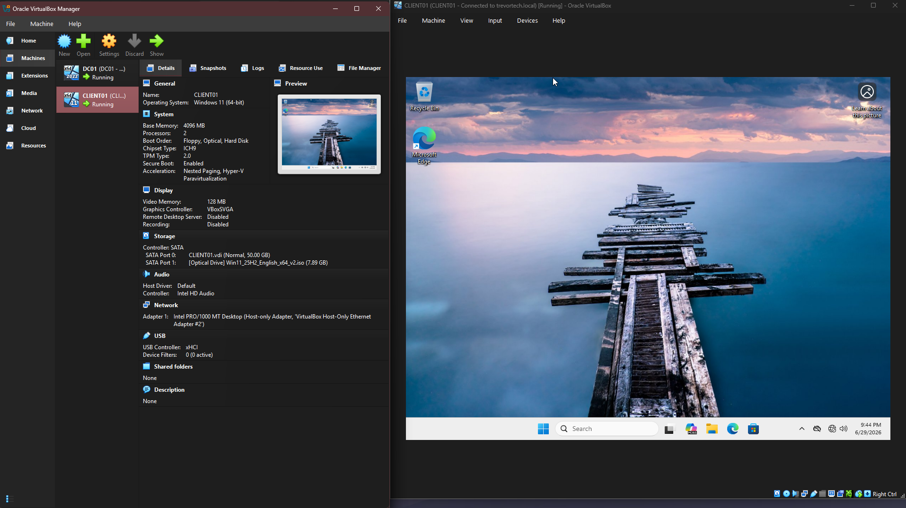
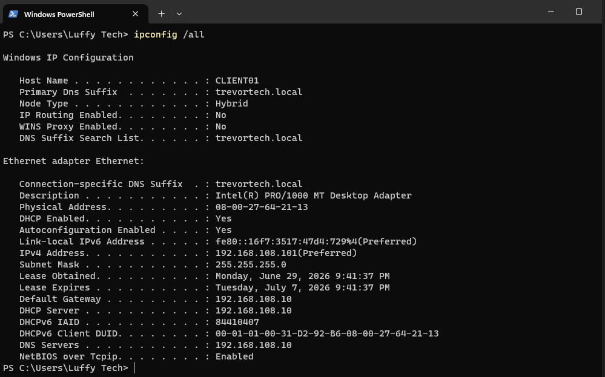

# Windows 11 Client Installation (CLIENT01)

## Objective

In this step, I set up a Windows 11 client machine called **CLIENT01** so it could eventually join the **trevortech.local** domain. The goal was to simulate a real workstation that would be used inside an Active Directory environment.

---

## Environment

| Component               | Configuration     |
| ----------------------- | ----------------- |
| Operating System        | Windows 11 Pro    |
| VM Name                 | CLIENT01          |
| Virtualization Platform | Oracle VirtualBox |
| Memory                  | 4 GB RAM          |
| Processors              | 2 vCPUs           |
| Storage                 | 64 GB VDI         |
| Network                 | Host-Only Adapter |

---

## Installation Notes

I installed Windows 11 Pro on a new virtual machine using the same Host-Only network as the domain controller.

During setup, Windows blocked the install because of hardware requirements (TPM and Secure Boot). I worked around this using registry edits during installation so I could continue with the setup in a virtual environment.

After installation, I also bypassed the internet requirement during OOBE so I could create a local admin account instead of being forced into a Microsoft account.

---

## Network Setup

Once Windows was installed, the machine automatically picked up its network settings from the domain controller’s DHCP service.

| Setting         | Value            |
| --------------- | ---------------- |
| Computer Name   | CLIENT01         |
| IP Address      | 192.168.108.101  |
| Subnet Mask     | 255.255.255.0    |
| Default Gateway | 192.168.108.10   |
| DNS Server      | 192.168.108.10   |
| Domain Suffix   | trevortech.local |

At this point, CLIENT01 could properly see the domain controller on the network.

---

## Domain Join

After confirming DNS and connectivity were working, I joined CLIENT01 to the **trevortech.local** domain using the domain admin account.

Once the machine rebooted, I was able to log in using a domain user account, confirming that the join was successful.

---

## What I Checked

* DHCP assigned the correct IP address
* DNS pointed to the domain controller
* CLIENT01 could reach DC01 over the network
* Domain join completed successfully
* Domain login worked after reboot

---

## Lessons Learned

This part of the lab really showed how important DNS is in Active Directory. Even if the network looks correct, the domain join will fail if DNS isn’t pointing to the domain controller.

It also helped reinforce how Windows 11 setup behaves in virtual environments, especially when hardware checks and internet requirements get in the way.

